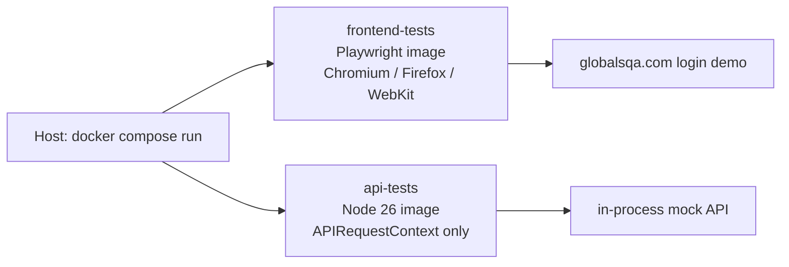

# Bonus: Docker

## What Docker is

Docker is a container platform. A **container** is a lightweight, isolated process with its own
filesystem, libraries and network namespace, started from an **image**. An image is a packaged
snapshot of an environment (OS userland + tools + application). Unlike a virtual machine, containers
share the host kernel, so they start in seconds and waste little RAM.

The pieces a QA engineer actually uses:

- **Dockerfile** — a recipe that builds an image (`FROM`, `COPY`, `RUN`, `CMD`).
- **Image** — the immutable result of that recipe, tagged (e.g. `playwright:v1.62.1-noble`).
- **Container** — a running instance of an image. Throw it away when the test run finishes.
- **Compose** — a YAML file that starts one or more containers together (app, database, test runner).

## Why it helps a QA engineer

| Problem without Docker | What Docker gives you |
| --- | --- |
| "Works on my machine" — different Node, browsers, OS libraries | The same image on a laptop, a teammate's machine and CI |
| Playwright browser installs differ per OS | Official Playwright image ships Chromium, Firefox and WebKit |
| Setting up a test stack (API + DB + cache) takes hours | `docker compose up` brings the whole environment up in one command |
| CI agents drift over time | The pipeline runs the same image the developer used locally |
| Parallel test jobs fight over ports and files | Each job gets its own isolated network and filesystem |
| Cleaning up after a failed run | `docker compose down -v` discards the environment completely |

In short: Docker turns the test environment into versioned, disposable infrastructure. That is the
difference between a flaky local run and a result you can trust in CI.

## Simple example: automated Playwright environment

This folder packages the two Playwright suites from this repository so they run without installing
Node, browsers or OS dependencies on the host.

```text
bonus-tasks/docker/
├── README.md                 # this file
├── compose.yaml              # one-command test environment
├── frontend.Dockerfile       # Task 2 — browsers included
└── api.Dockerfile            # Task 3 — API-only, no browsers
```



- **Frontend tests** use Microsoft's official Playwright image. Browsers and system libraries are
  already inside the image, so `npx playwright install` is not needed. The image tag
  (`v1.62.1-noble`) is pinned to the same Playwright version as `package.json`.
- **API tests** use a slim Node 26 image. Task 3 never launches a browser — the mock HTTP server
  runs in-process — so the heavy Playwright image would only waste download time.

`HUSKY=0` is set during `npm ci` so the frontend `prepare` script does not try to install git hooks
inside the container.

### How to run

Docker Desktop (or Engine + Compose v2) must be installed. From this directory:

```bash
cd bonus-tasks/docker

# Task 2 — login E2E (Chromium, Firefox, WebKit)
docker compose run --rm frontend-tests

# Task 3 — REST API suite (mocked in-process)
docker compose run --rm api-tests
```

The HTML report from the frontend run is written back to
`task-2-frontend-testing/playwright-report/` via a bind mount, so it can be opened on the host with
`npx playwright show-report`.

### What this demonstrates

1. The test runner is **reproducible** — anyone with Docker can run the same command.
2. The environment is **disposable** — `--rm` deletes the container after the run.
3. Compose is the natural place to grow the stack later (add a `postgres` service, an `app` service,
   a `depends_on` + healthcheck, then point Playwright at `http://app:3000`).

A typical next step for a real product would look like this:

```yaml
services:
  app:
    build: ../../app
    healthcheck:
      test: ["CMD", "curl", "-f", "http://localhost:3000/health"]
  db:
    image: postgres:16
  tests:
    build:
      context: ../../task-2-frontend-testing
      dockerfile: ../bonus-tasks/docker/frontend.Dockerfile
    depends_on:
      app:
        condition: service_healthy
    environment:
      CI: "true"
      BASE_URL: http://app:3000
```

The tests then always exercise a known application build and a fresh database, which is the core of
a reliable automated testing environment.
